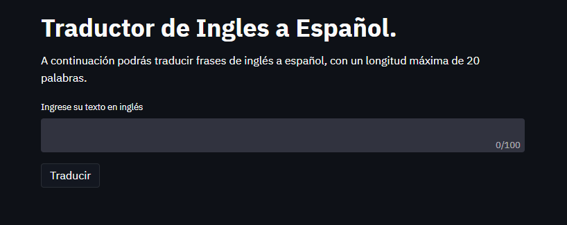
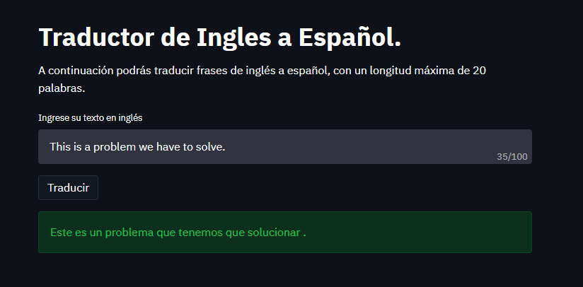

---

# Traductor Inglés a Español

Utilizando Transformes se desarrolló un traductor de inglés a español.

Se creó una plataforma que permite ingresar el texto en inglés y luego ser traducido a
español.

---

## Construcción del proyecto

Para este proyecto se utilizaron las siguientes herramientas:

* [Streamlit](https://streamlit.io/) - Framework web usado
* [Tensorflow](https://www.tensorflow.org/) - Librería para desarrollar modelos de ML.

---

## Instalación

Para iniciar el proyecto es necesario instalar las dependencias de la siguiente forma:

```
pip install -r requirements.txt
```

Al finalizar la instalación ejecutamos la aplicación con el siguiente comando:

```
streamlit run main.py
```

_Luego de iniciada la plataforma podrás predecir traducir tus textos en inglés._

---

## Probar la plataforma

Al iniciar la plataforma observarás un recuadro donde podrás ingresar tu texto en inglés.



Luego de ingresar el texto podrás presionar en el botón de _"Traducir"_ e iniciará el proceso de
traducción.




_Repitiendo este proceso, podrás traducir todas los textos en inglés que desee._

---

## Comentarios finales

* El traductor solo traduce de inglés a español, no es capaz de traducir de español a inglés.
* Al no disponer de suficiente entrenamiento se optó por utilizar un modelo más pequeño que el original.
* El modelo solo fue entrenado por 20 épocas, por lo tanto aún tiene un amplio margen de mejora.

---

## Autor

* **Argenis Gómez** - *Desarrollo del proyecto* - Github: [argenis-gomez](https://github.com/argenis-gomez)

---